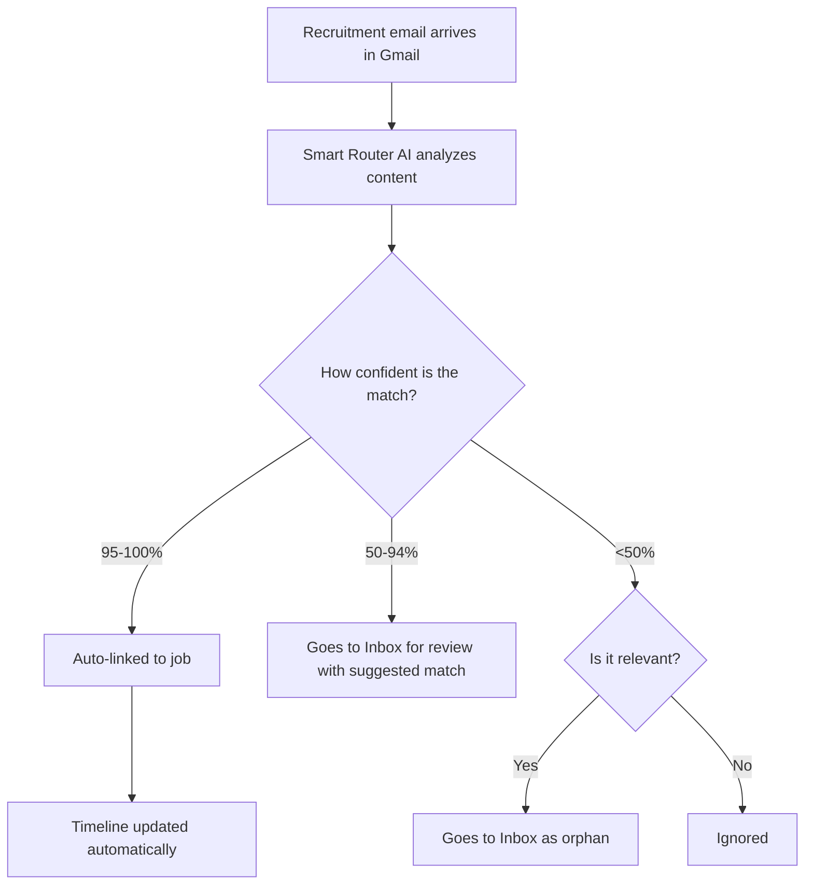

The Tracking Inbox monitors Gmail, O365, and IMAP mailboxes for job-application responses and updates timelines.


## Overview

1. Scans Gmail/O365/IMAP for recruitment-related emails
2. Matches emails to tracked jobs using AI
3. Updates timeline/state when confidence is high
4. Queues uncertain matches for manual review

## Smart router flow



## Setup

### Prerequisites

1. Gmail account with application emails
2. Google OAuth credentials

### Configure OAuth

Set:

```bash
GMAIL_OAUTH_CLIENT_ID=your-client-id.apps.googleusercontent.com
GMAIL_OAUTH_CLIENT_SECRET=your-client-secret
GMAIL_OAUTH_REDIRECT_URI=https://your-domain.com/oauth/gmail/callback
```

Then connect in UI via **Tracking Inbox → Connect Gmail**.

Detailed setup guide:

- [Gmail OAuth Setup](/docs/next/getting-started/gmail-oauth-setup)

### O365 OAuth

Set:

```bash
O365_OAUTH_CLIENT_ID=your-entra-app-client-id
O365_OAUTH_CLIENT_SECRET=your-entra-client-secret
O365_OAUTH_REDIRECT_URI=https://your-domain.com/oauth/o365/callback
O365_OAUTH_TENANT_ID=common
```

Then connect in UI via **Tracking Inbox → choose `o365` provider → Connect o365**.

Detailed setup guide:

- [O365 OAuth Setup (Entra ID / Azure)](/docs/next/getting-started/o365-oauth-setup)

### IMAP (any provider)

IMAP works with Gmail, Outlook, Yahoo, iCloud, and any IMAP-compatible email:

1. Open **Tracking Inbox**.
2. Select provider **imap**.
3. Click **Connect IMAP**.
4. Enter your IMAP server settings:
   - Host: e.g., `imap.gmail.com`, `outlook.office365.com`
   - Port: Usually `993` (IMAP over SSL)
   - User: Your email address
   - Password: Your password or app-specific password
   - TLS: Enable (recommended)

Detailed setup guide:

- [IMAP Email Setup](/docs/next/getting-started/imap-setup)

## Using the inbox

## Job emails tab

Open **Job → Emails** to review captured messages already linked to that job.

The tab is read-only. It shows stored metadata only: sender, subject, received
time, snippet, processing status, message type, match confidence, account label,
and a Gmail thread link when the stored message includes a Gmail thread ID.

It does not store full email bodies, re-fetch from Gmail, or expose review
actions. Use **Tracking Inbox** for approve/ignore decisions.

Confidence interpretation:

- `95-100%`: auto-processed
- `50-94%`: pending review with suggestion
- `<50%`: pending review as orphan/ignored

## Privacy and security

- Gmail scope: `https://www.googleapis.com/auth/gmail.readonly`
- O365 scope: `offline_access Mail.Read User.Read`
- IMAP: Direct credential authentication (passwords stored encrypted)
- Minimal metadata sent for matching
- Email data stays local in your instance

## API reference

| Method | Endpoint                                  | Description           |
| ------ | ----------------------------------------- | --------------------- |
| GET    | `/api/post-application/inbox`             | List pending messages |
| POST   | `/api/post-application/inbox/:id/approve` | Approve message       |
| POST   | `/api/post-application/inbox/:id/deny`    | Ignore message        |
| GET    | `/api/post-application/runs`              | List sync runs        |
| GET    | `/api/jobs/:id/emails?limit=100`          | List job-linked email metadata |
| GET    | `/api/post-application/providers/gmail/oauth/start` | Start OAuth flow |
| POST   | `/api/post-application/providers/gmail/oauth/exchange` | Exchange OAuth code |
| GET    | `/api/post-application/providers/o365/oauth/start` | Start OAuth flow |
| POST   | `/api/post-application/providers/o365/oauth/exchange` | Exchange OAuth code |

## Common issues

- No refresh token: disconnect and reconnect Gmail/O365.
- O365 token/tenant errors: confirm Entra app permissions and `O365_OAUTH_TENANT_ID`.
- IMAP authentication failed: verify credentials, enable app passwords if 2FA is enabled.
- Emails not appearing: check runs, OAuth/IMAP config, and recruitment subjects.
- Wrong matches: expected in lower-confidence buckets; use manual review.
