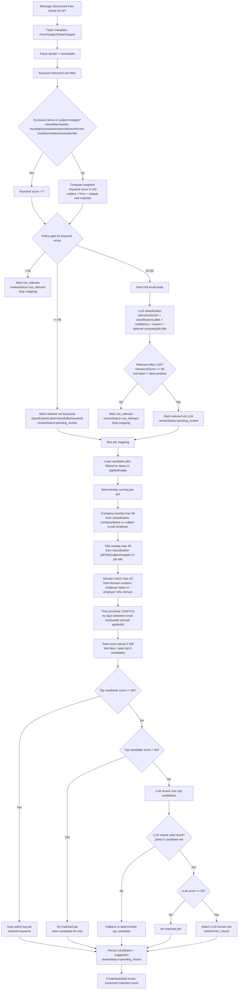

# Self-Hosting (Docker Compose)

The easiest way to run JobOps is via Docker Compose. The app is self-configuring and will guide you through the setup on your first visit.

## Prereqs

- Docker Desktop or Docker Engine + Compose v2

## 1) Start the stack

No environment variables are strictly required to start. Simply run:

```bash
docker compose up -d
```

This pulls the pre-built image from **GitHub Container Registry (GHCR)** and starts the API, UI, and scrapers in a single container. The image is multi-arch (supports `amd64` and `arm64`), making it compatible with Apple Silicon and Raspberry Pi.

If you want to build it yourself, you can run `docker compose up -d --build`.

## 2) Access the app and Onboard

Open your browser to:

- **Dashboard**: http://localhost:3005

On first launch, you will be greeted by an **Onboarding Wizard**. The app will help you validate and save your configuration:

1.  **LLM Provider**: OpenRouter is the default. Add an API key if required (OpenRouter/OpenAI/Gemini), or configure a local base URL (LM Studio/Ollama).
2.  **PDF Export**: Add your RxResume credentials (used to export PDFs from v4.rxresu.me).
3.  **Template Resume**: Select a base resume from your v4.rxresu.me account.

The app saves these to its persistent database, so you don't need to manage `.env` files for basic setup. All other settings (like search terms, job sources, and more) can also be configured directly in the UI.

Upgrade note: `OPENROUTER_API_KEY` is deprecated. Existing OpenRouter keys are automatically migrated/copied to `LLM_API_KEY` so you don't lose them.

## Gmail OAuth (Post-Application Inbox)

If you want to connect Gmail in the Tracking Inbox page, configure Google OAuth credentials for the API server.

### 1) Create Google OAuth credentials

In Google Cloud:

1. Open your project (or create one), then configure the OAuth consent screen.
2. Enable the Gmail API.
3. Create an OAuth client ID (`Web application` type).
4. Add an authorized redirect URI:
   - `http://localhost:3005/oauth/gmail/callback` (default local setup)
   - or your deployed app URL, for example `https://your-domain.com/oauth/gmail/callback`

### 2) Configure environment variables

Set these on the JobOps container:

- `GMAIL_OAUTH_CLIENT_ID` (required)
- `GMAIL_OAUTH_CLIENT_SECRET` (required)
- `GMAIL_OAUTH_REDIRECT_URI` (optional, recommended for production)
  - If omitted, JobOps derives it from the incoming request host as `/oauth/gmail/callback`.

### 3) Restart and connect

After setting env vars, restart the container and use `Tracking Inbox -> Connect Gmail`.

Notes:

- JobOps requests `gmail.readonly` scope.
- If Google returns no refresh token, disconnect and re-connect to force a fresh consent flow.

## Email-to-Job Matching Decision Tree

When Gmail sync runs, each discovered message goes through this full decision tree before it appears as matched (or unmatched) in Tracking Inbox:



Key thresholds and filters:

- Relevance thresholds: `<60` not relevant, `60-94` LLM required, `>=95` high-confidence relevant.
- LLM relevance guard: still requires `relevanceScore >= 60` and classification label not equal to `false positive`.
- Mapping thresholds: `<60` no match, `60-94` uncertain (LLM rerank path), `>=95` deterministic auto-match.
- Candidate pool filter: only jobs in `applied` or `ready` statuses are considered for matching.
- Candidate cap filter: only top `5` deterministic candidates are passed to reranking/persistence.

## Persistent data

`./data` is bind-mounted into the container. It stores:

- SQLite DB: `data/jobs.db` (contains your API keys and configuration)
- Generated PDFs: `data/pdfs/`
- Template resume selection: Stored internally after selection.

## Public demo deployment (`DEMO_MODE=true`)

For a public sandbox website, set `DEMO_MODE=true` on the container.

Behavior in demo mode:

- **Works (local demo DB):** browsing, filtering, job status updates, timeline edits.
- **Simulated (no external side effects):** pipeline run, job summarize/process/rescore/pdf/apply, onboarding validations.
- **Blocked:** settings writes, database clear, backup create/delete, status bulk deletes.
- **Auto-reset:** seeded demo data is reset every 6 hours.

## Updating

```bash
git pull
docker compose pull
docker compose up -d
```
